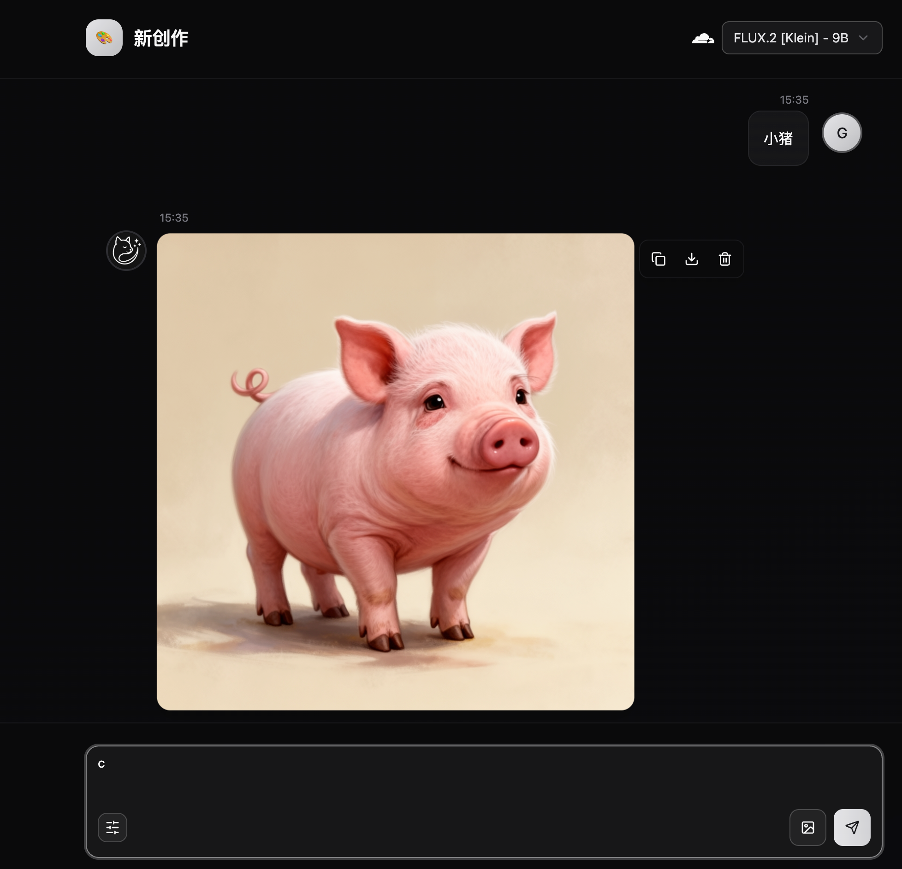

# 图虫 Tuchong - 输入即图像


图虫（Tuchong）是一款现代化、易用、隐私安全的 AI 图像生成工具，为 AI 创作者提供一站式生成体验，支持部署到 Cloudflare Workers，并可使用 Cloudflare Workers AI 模型。



## 🎯 快速使用

部署完成后即可在您自己的 Cloudflare Workers 地址使用。项目源码、版本和问题追踪均以 [xinnian999/tuchong](https://github.com/xinnian999/tuchong) 为准。

## ✨ 核心特性

专注 AI 图像生成，让创意瞬间成为视觉艺术

- 📱 **本地优先** - 优先使用本地存储和离线功能
- 🏠 **自托管部署** - 完全掌控您的数据和隐私
- 🎁 **免费生图** - 免费使用 Cloudflare Workers AI 生图
- ☁️ **一键部署** - Docker 和 Cloudflare Workers 快速上线
- 🤖 **多模型支持** - 支持多种 AI 模型和服务提供商
- 🔄 **云同步** - 在所有设备间无缝同步您的内容

## 🔒 数据安全

图虫将您的数据安全和隐私保护放在首位：

- **🛡️ 浏览器本地存储** - 基于 WASM SQLite 技术，所有数据完全存储在您的浏览器上
- **🔐 零数据上传** - 您的创作内容、设置信息等敏感数据从不离开您的设备
- **🚫 无服务器依赖** - 客户端模式无需依赖外部服务器，保障数据主权
- **🔄 可选云同步** - 支持可选的云同步功能

您的创意和隐私，我们一并守护。

## ⚡ 领先 AI 模型驱动

集成最先进的 AI 模型和服务，为您提供最佳的图像生成体验：

- **Google** - 先进的 AI 模型，具备前沿的图像生成能力
- **OpenAI** - 业界领先的 AI 技术
- **Flux** - 高质量图像生成模型
- **Fal** - 快速 AI 推理服务
- **Cloudflare** - 免费 AI 模型支持

更多服务商和模型正在持续接入中。

## 🚀 快速部署

### Cloudflare Workers 一键部署（推荐）

[](https://deploy.workers.cloudflare.com/?url=https://github.com/xinnian999/tuchong)

Cloudflare Workers 部署可以免费享受 Cloudflare AI 提供的图像生成服务。

> 部署成功后，您将获得一个 `tuchong.xxx.workers.dev` 域名，即可开始使用！若复用既有 D1 数据库，请先阅读下方的兼容说明。

### Docker 部署

```bash
docker build -t tuchong .
docker run --name tuchong -d -p 9999:9999 tuchong
```

### Node.js 部署

#### 前置要求

- Node.js 20+
- pnpm 或 npm

#### 部署步骤

1. **克隆并安装**

```bash
git clone https://github.com/xinnian999/tuchong.git
cd tuchong
pnpm install
```

2. **配置环境变量**

```bash
cp .env.node.example .env
# 编辑 .env 文件配置必要参数
```

3. **数据库初始化**

```bash
pnpm db:generate
pnpm db:migrate
```

4. **构建项目**

```bash
pnpm build:node
```

5. **启动服务**

```bash
node .bin/node.js
```

## 🛠️ 开发文档

### 技术栈

**前端框架：**

- **React 18** - 现代化 UI 框架
- **TypeScript** - 类型安全的 JavaScript
- **Tailwind CSS** - 原子化 CSS 框架
- **shadcn/ui** - 高质量 UI 组件库
- **Tanstack Router** - 类型安全的路由管理
- **Zustand** - 轻量级状态管理
- **BetterAuth** - 现代化认证解决方案

**后端框架：**

- **Hono.js** - 轻量级 Web 框架
- **SQLite** - 嵌入式数据库
- **Drizzle ORM** - 类型安全的 ORM

**开发工具：**

- **Vite** - 快速构建工具
- **Biome** - 代码格式化和检查
- **pnpm** - 包管理器

### 本地开发指引

#### 环境准备

1. **安装 Node.js 20+**
2. **安装 pnpm**

```bash
npm install -g pnpm
```

#### 开发流程

1. **克隆项目**

```bash
git clone https://github.com/xinnian999/tuchong.git
cd tuchong
```

2. **安装依赖**

```bash
pnpm install
```

3. **数据库初始化**

```bash
# 生成数据库迁移文件
pnpm db:generate

# 执行迁移
pnpm db:migrate
```

4. **启动开发服务器**

```bash
# 启动前端开发服务器
pnpm dev
```

#### 项目结构

```
src/
├── app/                    # 前端应用
│   ├── components/         # React 组件
│   ├── hooks/             # 自定义 Hooks
│   ├── routes/            # 路由页面
│   ├── stores/            # 状态管理
│   └── lib/               # 工具库
├── server/                # 后端服务
│   ├── api/               # API 路由
│   ├── ai/                # AI 提供商集成
│   ├── db/                # 数据库模式
│   └── service/           # 业务逻辑
```

---
